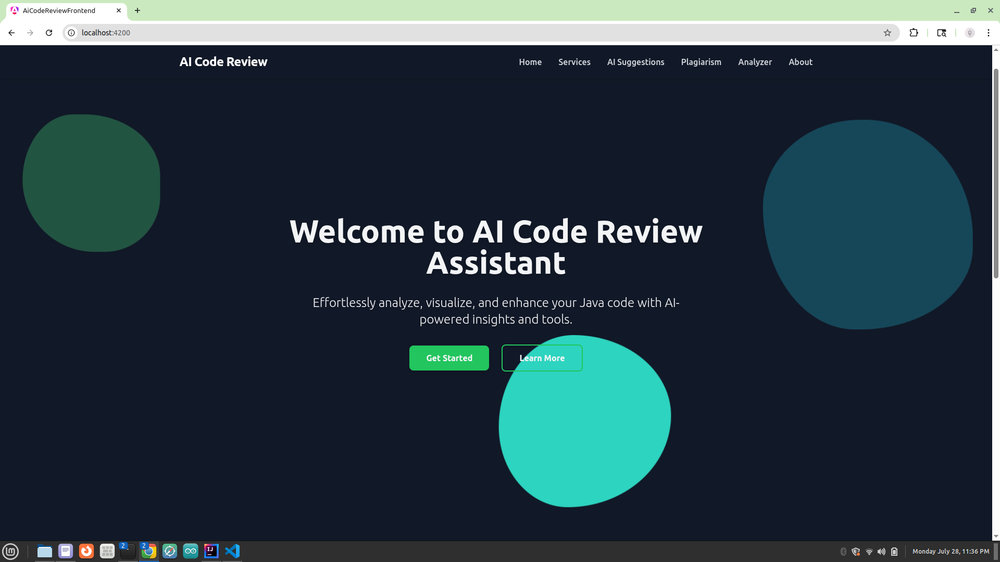

# 💡 AI Code Review Assistant

An AI-powered web app that analyzes, reviews, and compares source code using static analysis, local AI suggestions (TinyLLaMA), and plagiarism detection.

---

## 📌 Overview

**AI Code Review Assistant** helps users:
- 📊 Analyze Java code with metrics and flow diagrams
- 🧠 Get AI-generated code suggestions for Java, Python, JS, C, C++
- 🔍 Detect plagiarism using Levenshtein & token-based similarity
- 📈 View history and code quality insights

---

---

## 🖼️ UI Preview

### 📌 Home + Features Preview



---

## 🏗️ Project Structure

```

AI-CODE-REVIEW-ASSISTANT/
├── Algorithms/             # Java logic for analysis and similarity
├── backend/                # Spring Boot APIs (JavaParser, AI, plagiarism)
│   ├── controller/
│   ├── service/
│   ├── model/
│   └── util/
├── frontend/               # Angular UI (Tailwind, Mermaid, Charts)
│   └── ai-code-review-frontend/
│       ├── src/
│       │   └── app/
│       │       ├── components/     # Navbar, Footer
│       │       └── pages/          # Home, Plagiarism, Suggestions, Analyzer
├── local-llm/              # TinyLLaMA Flask app
├── resources/              # 📸 Screenshots, abstracts, docs
└── README.md

```

---

## 🔑 Core Features

- 🔐 **Login/Register** (JWT-based, coming soon)
- 💻 **Java Static Analysis**
  - Metrics (LOC, complexity, score)
  - Class/Method summary
  - Mermaid.js flowchart
- 🤖 **AI Suggestions** (TinyLLaMA)
  - For Java, Python, JS, C, C++
  - Uses local LLM via Flask & llama-cpp
- 📋 **Plagiarism Detection**
  - Levenshtein Distance
  - Token Jaccard Similarity
- 📂 **Code Submission History** (optional DB)
- 📊 **Code Quality Charts** (Recharts/Chart.js)

---

## ⚙️ Tech Stack

**Backend (Spring Boot):**
- JavaParser (AST)
- Custom algorithms (Levenshtein, token-based)
- REST APIs, Caching
- MySQL / MongoDB (optional)

**Frontend (Angular):**
- Angular + TailwindCSS
- Standalone components
- Mermaid.js (flowchart), Recharts
- Monaco Editor (for code input)

**Local AI (TinyLLaMA):**
- llama-cpp-python + Flask
- Open-source, offline LLM
- Runs at `http://localhost:5000/chat`

---

## 🧪 API Endpoints

### 🔍 Static Analysis
```

POST /api/analyze
Content-Type: text/plain
Body: <Java code>

```

### 🤖 AI Suggestions (LLM)
```

POST /api/ai-suggest
{
"language": "java",
"code": "public class Hello { ... }"
}

```

### 🔄 Plagiarism Check
```

POST /api/plagiarism
{
"code1": "...",
"code2": "..."
}

````

---

## ⚡ Running TinyLLaMA (LLM)

1. Download model (`.gguf`) from Hugging Face  
2. Install Python dependencies:
```bash
pip install llama-cpp-python flask
````

3. Create `app.py`:

```python
from llama_cpp import Llama
from flask import Flask, request, jsonify

app = Flask(__name__)
llm = Llama(model_path="your_model_path.gguf")

@app.route("/chat", methods=["POST"])
def chat():
    prompt = request.json.get("prompt", "")
    output = llm(prompt, max_tokens=256)
    return jsonify(output)

app.run(port=5000)
```

4. Run it:

```bash
python app.py
```


## 🔮 Future Scope

* 📥 Export results as PDF
* 🔗 GitHub repo scanning
* 📊 Admin dashboard
* ⚡ Real-time feedback (WebSocket)
* 🧠 Replace OpenAI fully with TinyLLaMA/Ollama

---

## 📚 License

> 🎓 MCA Minor Project Submission
> **Murali Krishna (CHN24MCA-2039)**
> *Academic/demo use only*

---

> ✨ *Let code review be smart, AI-driven, and visual!*


